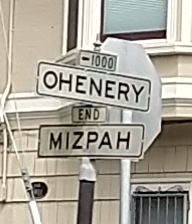

```{r setup,include=FALSE}
# set the knitr options ... for everyone!
# if you unset this, then vignette build bonks. oh, joy.
#opts_knit$set(progress=TRUE)
opts_knit$set(eval.after='fig.cap')
# for a package vignette, you do want to echo.
# opts_chunk$set(echo=FALSE,warning=FALSE,message=FALSE)
opts_chunk$set(warning=FALSE,message=FALSE)
#opts_chunk$set(results="asis")
opts_chunk$set(cache=TRUE,cache.path="cache/")

#opts_chunk$set(fig.path="figure/",dev=c("pdf","cairo_ps"))
opts_chunk$set(fig.path="tools/figure/",dev=c("png"))
opts_chunk$set(fig.width=7,fig.height=6,dpi=100,out.width='700px',out.height='600px')

# doing this means that png files are made of figures;
# the savings is small, and it looks like shit:
#opts_chunk$set(fig.path="figure/",dev=c("png","pdf","cairo_ps"))
#opts_chunk$set(fig.width=4,fig.height=4)
# for figures? this is sweave-specific?
#opts_knit$set(eps=TRUE)

# this would be for figures:
#opts_chunk$set(out.width='.8\\textwidth')
# for text wrapping:
options(width=96,digits=2)
opts_chunk$set(size="small")
opts_chunk$set(tidy=FALSE,tidy.opts=list(width.cutoff=60,keep.blank.line=TRUE))
library(ggplot2)
library(ohenery)
library(dplyr)
library(tidyr)
library(moments)
library(microbenchmark)
# chicken and egg dept:
#[](http://cran.rstudio.com/package=ohenery) 
#[](https://cran.rstudio.com/web/packages/ohenery/index.html)
#[](https://cran.r-project.org/web/packages/ohenery/index.html)
#[](https://cran.rstudio.com/web/packages/ohenery/index.html)
#[](http://cran.rstudio.com/package=ohenery) 
#[](http://www.r-pkg.org/pkg/ohenery)
#[](http://www.r-pkg.org/pkg/ohenery)

# I just CRAN't
# [](http://www.r-pkg.org/pkg/ohenery)
# [](http://www.r-pkg.org/pkg/ohenery)
```

# ohenery

[](https://travis-ci.org/shabbychef/ohenery)
[](http://codecov.io/github/shabbychef/ohenery?branch=master)
[](https://cran.r-project.org/package=ohenery)


Performs softmax regression for ordered outcomes under the [Harville](http://dx.doi.org/10.1080/01621459.1973.10482425)
and [Henery](http://dx.doi.org/10.1111/j.2517-6161.1981.tb01153.x) models.


-- Steven E. Pav, shabbychef@gmail.com

## Installation

This package can be installed 
from CRAN, 
via [drat](https://github.com/eddelbuettel/drat "drat"), or
from github:

```{r install,eval=FALSE,echo=TRUE}
# via CRAN:
install.packages("ohenery")
# via drat:
if (require(drat)) {
    drat:::add("shabbychef")
    install.packages("ohenery")
}
# get snapshot from github (may be buggy)
if (require(devtools)) {
  install_github('shabbychef/ohenery')
}
```

## What is it?



The softmax regression generalizes logistic regression, wherein only one of two
possible outcomes is observed, to the case where one of many possible outcomes is observed.
As in logistic regression, one models the log odds of each outcome as a linear
function of some independent variables.
Moreover, a softmax regression allows one to model data from events where the number
of possible outcomes differs.

Some examples where one might apply a softmax regression:

  * Model which among five sprinters takes first place in a race,
    having observed characteristics of the runners over many races.
  * Model which film is awarded the Academy Award for Best Picture,
    based on genre information, and co-nomination information.
    (The number of nominees has varied over the years.)
  * Model which major city in the U.S. experiences the most rain
    in a given calendar year.

Note that in the examples illustrated above, one might be better served
by modeling some continuous outcome, instead of modeling the winner.
For example, one might model the speed of each racer, or the number of
votes each film garnered, or the total amount of rain each city experienced.
Discarding this information in favor of modeling the binary outcome is
likely to cause a loss of statistical power, and is 
[generally discouraged](https://statmodeling.stat.columbia.edu/2014/02/25/basketball-stats-dont-model-probability-win-model-expected-score-differential/).
However, in some cases the continuous outcome is _not_ observed, as
in the case of the Best Picture awards, or in horse racing where finishing
times are often not available.
Softmax regression can be used in these cases.

The softmax regression can be further generalized to model the case where
one observes place information about participants. For example, one might
observe which of first through fifth place each sprinter claims in each race.  
Or one might only observe some limited information, like the 
Gold, Silver and Bronze medal winners in an Olympic event.

There is more than one way to generalize the softmax to deal with ranked
outcomes like these:

  * The Harville model, where the ratio of probabilities of two participants
    taking first place is equal to the ratio of the conditional probabilities that they
    take second place, conditional on neither of them taking first place.
    Effectively in the Harville model once one has observed the first place
    finisher, the probabilities for second place simply rescale.
    I believe that if finishing times for racers are exponentially distributed,
    then their finishing places are distributed under a Harville model.
  * The Henery model generalizes the Harville model to the case where the
    ratio of probabilities of two participants
    taking first place is equal to the ratio of the conditional probabilities that they
    take second place, conditional on neither of them taking first place,
    _raised to some power_, called gamma.  The Harville model is the Henery model with all
    gamma constants equal to one.
    I believe that if finishing times for racers are (log) normally distributed, 
    then their finishing places are nearly distributed like the Henery model.


This package supports fitting softmax regressions under both models.

## Basic Usage

### Best Picture

Here we use softmax regression to model the Best Picture winner odds
as linear in some features: whether the film also was nominated for
Best Director, Best Actor or Actress, or Best Film Editing, as well
as genre designations for Drama, Romance and Comedy.
We only observe the winner of the Best Picture award, and not
runners-up, so we weight the first place finisher with a one,
and all others with a zero.
This seems odd, but it ensures that the regression does not try
to compare model differences between the runners-up.
We find the strongest absolute effect on odds from the Best Director
and Film Editing co-nomination variables.


```{r best_picture,eval=TRUE,echo=TRUE}
library(ohenery)
library(dplyr)
library(magrittr)
data(best_picture)
best_picture %<>%
  mutate(place=ifelse(winner,1,2)) %>%
  mutate(weight=ifelse(winner,1,0))

fmla <- place ~ nominated_for_BestDirector + nominated_for_BestActor + nominated_for_BestActress + nominated_for_BestFilmEditing + Drama + Romance + Comedy

osmod <- harsm(fmla,data=best_picture,group=year,weights=weight) 
print(osmod)

```

### Prediction

Here we use the `predict` method to get back predictions under
the Harville model produced above. 
Three different types of prediction are supported:

1. Predictions of the odds in odds space, the 'eta'.
1. Predictions of the probability of taking first place, the 'mu'.
1. The expected rank under a Harville model.

We do not currently have the ability to compute the
expected rank under the Henery model, as it is too computationally
intensive. (File an issue if this is important.)

```{r best_preds,eval=TRUE,echo=TRUE}
prd <- best_picture %>%
	mutate(prd_erank=as.numeric(predict(osmod,newdata=.,group=year,type='erank',na.action=na.pass))) %>%
	mutate(prd_eta=as.numeric(predict(osmod,newdata=.,group=year,type='eta'))) %>%
	mutate(prd_mu=as.numeric(predict(osmod,newdata=.,group=year,type='mu'))) 
```

### Horse Racing

The package is bundled with a dataset of three weeks of
thoroughbred and harness race results from tracks around the world.
First, let us compare the 'consensus odds', as computed from
the win pool size, with the probability of winning a race.
This is usually plotted as the empirical win probability
over horses grouped by their consensus win probability.

We present this plot below.
Clearly visible are the 'longshot bias' and 
'sureshot bias' (or favorite bias).
The longshot bias is the effect where longshots are overbet,
resulting in elevated consensus odds. 
This appears as the point off the line in the lower left. 
One can think of these as points which were moved 
_to the right_ of the plot from a point on the diagonal
by overbetting.
The sureshot bias is the complementary effect where
favorites to win are underbet, effectively shifting the
points to the left.


```{r race_data_efficiency,eval=TRUE,echo=TRUE}
library(ohenery)
library(dplyr)
library(magrittr)
library(ggplot2)

data(race_data)

ph <- race_data %>%
  group_by(EventId) %>%
    mutate(mu0=WN_pool / sum(WN_pool)) %>%
  ungroup() %>%
  mutate(mubkt=cut(mu0,c(0,10^seq(-2,0,length.out=14)),include.lowest=TRUE)) %>%
  mutate(tookfirst=as.numeric(coalesce(Finish==1,FALSE))) %>%
  group_by(mubkt) %>%
    summarize(winprop=mean(tookfirst),
              medmu=median(mu0),
              nrace=length(unique(EventId)),
              nhorse=n()) %>%
  ungroup() %>%
  ggplot(aes(medmu,winprop)) + 
  geom_point(aes(size=nhorse)) + 
  geom_abline(intercept=0,slope=1) + 
  scale_x_log10(labels=scales::percent) + 
  scale_y_log10(labels=scales::percent) +
  labs(x='consensus odds (from win pool)',
       y='empirical win probability',
       title='efficiency of the win pool')
print(ph)
```

Here we use softmax regression under the Harville model to capture
the longshot and sureshot biases.
Our model computes consensus odds as the inverse softmax
function of the consensus probabilities, which are constructed
from the win pool.
We define a factor variable that captures longshot, sureshot,
and 'vanilla' bets based on the win pool-implied probabilities.
Here we are only concerned with the win probabilities,
so we adapt a Harville model and weight only the winning
finishers.

```{r race_data_har_fits,eval=TRUE,echo=TRUE,dependson=c('race_data_efficiency')}
# because of na.action, make ties for fourth
df <- race_data %>%
  mutate(Outcome=coalesce(Finish,4L)) 

# create consensus odds eta0
df %<>%
  mutate(weights=coalesce(as.numeric(Finish==1),0) ) %>%
  group_by(EventId) %>%
    mutate(big_field=(n() >= 6)) %>%
    mutate(mu0=WN_pool / sum(WN_pool)) %>%
    mutate(eta0=inv_smax(mu0)) %>%
  ungroup() %>%
  dplyr::filter(big_field) %>%
  dplyr::filter(!is.na(eta0)) %>%
  mutate(bettype=factor(case_when(mu0 < 0.025 ~ 'LONGSHOT',
                                  mu0 > 0.50  ~ 'SURESHOT',
                                  TRUE        ~ 'VANILLA'))) 

# Harville Model with market efficiency
effmod <- harsm(Outcome ~ eta0:bettype,data=df,group=EventId,weights=weights)
print(effmod)
```

We see that in this model the beta coefficient for consensus odds
is around `r as.numeric(coefficients(effmod)['eta0:bettypeVANILLA'] )` for 'vanilla' bets,
slightly higher for sure bets, and much higher for longshots.
The interpretation is that long shots are relatively overbet,
but that otherwise bets are nearly efficient.

One would like to make a correction to inefficiencies in the 
win pool by generalizing this idea to multiple cut points along the consensus
probabilities.
However, the softmax model works by tweaking the consensus odds;
the odds translate into win probabilities in a way that depends on the
other participants, and so there is no one curve.

### Offsets

The print display of the Harville softmax regression includes an 'R-squared' 
and sometimes a 'delta R-squared'. 
The latter is only reported when an offset is used in the model.
The R-squared is the improvement in spread in the predicted ranks from the 
model compared to the null model which assumes all log odds are equal.
When an offset is given, the R-squared includes the offset,
but a 'delta' R-squared is reported which gives the improvement
in spread of predicted ranks over the model based on the offset:

```{r race_data_offset_fits,eval=TRUE,echo=TRUE,dependson=c('race_data_har_fits')}
# Harville Model with offset
offmod <- harsm(Outcome ~ offset(eta0) + bettype,data=df,group=EventId,weights=weights)
print(offmod)
```

Unfortunately, the R-squareds are hard to interpret, and can sometimes give
negative values. The softmax regression is not guaranteed to improve the
residual sum of squared errors in the rank.

### Henery Model

Here we fit a Henery model to the horse race data.
Note that in the data we only observe win, place, and show finishes, 
so we assign zero weight to all other finishers.  
Again this is so the regression does not attempt to model distinctions between runners-up.
Moreover, because of how `na.action` works on the input data,
the response variable has to be coalesced with tie-breakers.


```{r race_data_hen_fits,eval=TRUE,echo=TRUE,dependson=c('race_data_efficiency')}
# because of na.action, make ties for fourth
df <- race_data %>%
  mutate(Outcome=coalesce(Finish,4L)) %>%
  mutate(weights=coalesce(as.numeric(Finish<=3),0) ) %>%  # w/p/s 
  group_by(EventId) %>%
    mutate(big_field=(n() >= 5)) %>%
    mutate(mu0=WN_pool / sum(WN_pool)) %>%
    mutate(eta0=inv_smax(mu0)) %>%
  ungroup() %>%
  dplyr::filter(big_field) %>%
  dplyr::filter(!is.na(eta0)) %>%
	mutate(fac_age=cut(Age,c(0,3,5,7,Inf),include.lowest=TRUE)) %>%
  mutate(bettype=factor(case_when(mu0 < 0.025 ~ 'LONGSHOT',
                                  mu0 > 0.50  ~ 'SURESHOT',
                                  TRUE        ~ 'VANILLA'))) 

# Henery Model with ...
bigmod <- hensm(Outcome ~ eta0:bettype + fac_age,data=df,group=EventId,weights=weights,ngamma=3)
print(bigmod)
```

Note that the gamma coefficients are fit here as
`r bigmod$gammas`. 
Values around 0.8 or smaller are typical.
(In a future release it would probably make sense to
make the gammas relative to the value 1,
which would make it easier to reject the Harville
model from the print summary.)

### Diving

The package is bundled with a dataset of 100 years of Olympic Men's
Platform Diving Records, originally sourced by Randi Griffin
and delivered on 
[kaggle](https://www.kaggle.com/heesoo37/120-years-of-olympic-history-athletes-and-results).

Here we convert the medal records into finishing places of 1, 2, 3 and 4 (no
medal), add weights for the fitting,
make a factor variable for age, factor the NOC (country) of the athlete.
Because Platform Diving is a subjective competition, based on scores from
judges, we investigate whether there is a 'home field advantage'
by creating a Boolean variable indicating whether the athlete is representing
the host nation.

We then fit a Henery model to the data. Note that the gamma terms come
out very close to one, indicating the Harville model would be sufficient.
The home field advantage appears real in this analysis, though modest.


```{r diving_fits,eval=TRUE,echo=TRUE}
library(forcats)
data(diving)
fitdat <- diving %>%
  mutate(Finish=case_when(grepl('Gold',Medal)   ~ 1,
                          grepl('Silver',Medal) ~ 2,
                          grepl('Bronze',Medal) ~ 3,
                          TRUE ~ 4)) %>%
  mutate(weight=ifelse(Finish <= 3,1,0)) %>%
  mutate(cut_age=cut(coalesce(Age,22.0),c(12,19.5,21.5,22.5,25.5,99),include.lowest=TRUE)) %>%
  mutate(country=forcats::fct_relevel(forcats::fct_lump(factor(NOC),n=5),'Other')) %>%
  mutate(home_advantage=NOC==HOST_NOC)

hensm(Finish ~ cut_age + country + home_advantage,data=fitdat,weights=weight,group=EventId,ngamma=3)
```
