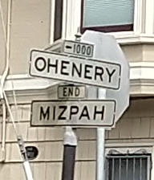
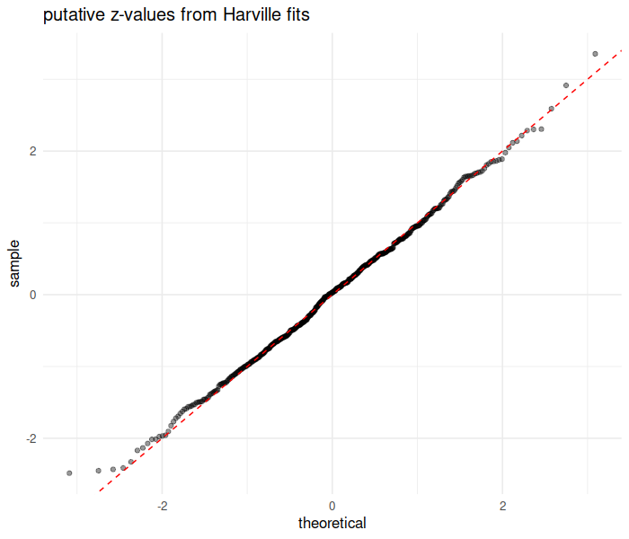

# ohenery

[](https://travis-ci.org/shabbychef/ohenery)
[](http://codecov.io/github/shabbychef/ohenery?branch=master)
[](https://cran.r-project.org/package=ohenery)
[](http://www.r-pkg.org/pkg/ohenery)
[](http://www.r-pkg.org/pkg/ohenery)


Performs softmax regression for ordered outcomes under the [Harville](http://dx.doi.org/10.1080/01621459.1973.10482425)
and [Henery](http://dx.doi.org/10.1111/j.2517-6161.1981.tb01153.x) models.


-- Steven E. Pav, shabbychef@gmail.com

## Installation

This package can be installed 
from CRAN, 
via [drat](https://github.com/eddelbuettel/drat "drat"), or
from github:


```r
# via CRAN:
install.packages("ohenery")
# via drat:
if (require(drat)) {
    drat:::add("shabbychef")
    install.packages("ohenery")
}
# get snapshot from github (may be buggy)
if (require(devtools)) {
  install_github('shabbychef/ohenery')
}
```

## What is it?



The softmax regression generalizes logistic regression, wherein only one of two
possible outcomes is observed, to the case where one of many possible outcomes is observed.
As in logistic regression, one models the log odds of each outcome as a linear
function of some independent variables.
Moreover, a softmax regression allows one to model data from events where the number
of possible outcomes differs.

Some examples where one might apply a softmax regression:

  * Model which among five sprinters takes first place in a race,
    having observed characteristics of the runners over many races.
  * Model which film is awarded the Academy Award for Best Picture,
    based on genre information, and co-nomination information.
    (The number of nominees has varied over the years.)
  * Model which major city in the U.S. experiences the most rain
    in a given calendar year.

Note that in the examples illustrated above, one might be better served
by modeling some continuous outcome, instead of modeling the winner.
For example, one might model the speed of each racer, or the number of
votes each film garnered, or the total amount of rain each city experienced.
Discarding this information in favor of modeling the binary outcome is
likely to cause a loss of statistical power, and is 
[generally discouraged](https://statmodeling.stat.columbia.edu/2014/02/25/basketball-stats-dont-model-probability-win-model-expected-score-differential/).
However, in some cases the continuous outcome is _not_ observed, as
in the case of the Best Picture awards, or in horse racing where finishing
times are often not available.
Softmax regression can be used in these cases.

The softmax regression can be further generalized to model the case where
one observes place information about participants. For example, one might
observe which of first through fifth place each sprinter claims in each race.  
Or one might only observe some limited information, like the 
Gold, Silver and Bronze medal winners in an Olympic event.

There is more than one way to generalize the softmax to deal with ranked
outcomes like these:

  * The Harville model, where the ratio of probabilities of two participants
    taking first place is equal to the ratio of the conditional probabilities that they
    take second place, conditional on neither of them taking first place.
    Effectively in the Harville model once one has observed the first place
    finisher, the probabilities for second place simply rescale.
    I believe that if finishing times for racers are exponentially distributed,
    then their finishing places are distributed under a Harville model.
  * The Henery model generalizes the Harville model to the case where the
    ratio of probabilities of two participants
    taking first place is equal to the ratio of the conditional probabilities that they
    take second place, conditional on neither of them taking first place,
    _raised to some power_, called gamma.  The Harville model is the Henery model with all
    gamma constants equal to one.
    I believe that if finishing times for racers are (log) normally distributed, 
    then their finishing places are nearly distributed like the Henery model.


This package supports fitting softmax regressions under both models.

## Basic Usage

### Best Picture

Here we use softmax regression to model the Best Picture winner odds
as linear in some features: whether the film also was nominated for
Best Director, Best Actor or Actress, or Best Film Editing, as well
as genre designations for Drama, Romance and Comedy.
We only observe the winner of the Best Picture award, and not
runners-up, so we weight the first place finisher with a one,
and all others with a zero.
This seems odd, but it ensures that the regression does not try
to compare model differences between the runners-up.
We find the strongest absolute effect on odds from the Best Director
and Film Editing co-nomination variables.


```r
library(ohenery)
library(dplyr)
library(magrittr)
data(best_picture)
best_picture %<>%
  mutate(place=ifelse(winner,1,2)) %>%
  mutate(weight=ifelse(winner,1,0))

fmla <- place ~ nominated_for_BestDirector + nominated_for_BestActor + nominated_for_BestActress + nominated_for_BestFilmEditing + Drama + Romance + Comedy

osmod <- harsm(fmla,data=best_picture,group=year,weights=weight) 
print(osmod)
```

```
## --------------------------------------------
## Maximum Likelihood estimation
## BFGS maximization, 59 iterations
## Return code 0: successful convergence 
## Log-Likelihood: -92 
## 7  free parameters
## Estimates:
##                                   Estimate Std. error t value Pr(> t)    
## nominated_for_BestDirectorTRUE       3.294      0.850    3.88 0.00011 ***
## nominated_for_BestActorTRUE          1.003      0.316    3.18 0.00149 ** 
## nominated_for_BestActressTRUE        0.048      0.348    0.14 0.89048    
## nominated_for_BestFilmEditingTRUE    1.949      0.399    4.88   1e-06 ***
## Drama                               -0.659      0.605   -1.09 0.27580    
## Romance                              0.521      0.974    0.53 0.59291    
## Comedy                               1.317      1.013    1.30 0.19333    
## ---
## Signif. codes:  0 '***' 0.001 '**' 0.01 '*' 0.05 '.' 0.1 ' ' 1
## --------------------------------------------
##    R2: 0.77 
## --------------------------------------------
```

### Prediction

Here we use the `predict` method to get back predictions under
the Harville model produced above. 
Three different types of prediction are supported:

1. Predictions of the odds in odds space, the 'eta'.
1. Predictions of the probability of taking first place, the 'mu'.
1. The expected rank under a Harville model.

We do not currently have the ability to compute the
expected rank under the Henery model, as it is too computationally
intensive. (File an issue if this is important.)


```r
prd <- best_picture %>%
  mutate(prd_erank=as.numeric(predict(osmod,newdata=.,group=year,type='erank',na.action=na.pass))) %>%
  mutate(prd_eta=as.numeric(predict(osmod,newdata=.,group=year,type='eta'))) %>%
  mutate(prd_mu=as.numeric(predict(osmod,newdata=.,group=year,type='mu'))) 
```

### Horse Racing

The package is bundled with a dataset of three weeks of
thoroughbred and harness race results from tracks around the world.
First, let us compare the 'consensus odds', as computed from
the win pool size, with the probability of winning a race.
This is usually plotted as the empirical win probability
over horses grouped by their consensus win probability.

We present this plot below.
Clearly visible are the 'longshot bias' and 
'sureshot bias' (or favorite bias).
The longshot bias is the effect where longshots are overbet,
resulting in elevated consensus odds. 
This appears as the point off the line in the lower left. 
One can think of these as points which were moved 
_to the right_ of the plot from a point on the diagonal
by overbetting.
The sureshot bias is the complementary effect where
favorites to win are underbet, effectively shifting the
points to the left.


```r
library(ohenery)
library(dplyr)
library(magrittr)
library(ggplot2)

data(race_data)

ph <- race_data %>%
  group_by(EventId) %>%
    mutate(mu0=WN_pool / sum(WN_pool)) %>%
  ungroup() %>%
  mutate(mubkt=cut(mu0,c(0,10^seq(-2,0,length.out=14)),include.lowest=TRUE)) %>%
  mutate(tookfirst=as.numeric(coalesce(Finish==1,FALSE))) %>%
  group_by(mubkt) %>%
    summarize(winprop=mean(tookfirst),
              medmu=median(mu0),
              nrace=length(unique(EventId)),
              nhorse=n()) %>%
  ungroup() %>%
  ggplot(aes(medmu,winprop)) + 
  geom_point(aes(size=nhorse)) + 
  geom_abline(intercept=0,slope=1) + 
  scale_x_log10(labels=scales::percent) + 
  scale_y_log10(labels=scales::percent) +
  labs(x='consensus odds (from win pool)',
       y='empirical win probability',
       title='efficiency of the win pool')
print(ph)
```


Here we use softmax regression under the Harville model to capture
the longshot and sureshot biases.
Our model computes consensus odds as the inverse softmax
function of the consensus probabilities, which are constructed
from the win pool.
We define a factor variable that captures longshot, sureshot,
and 'vanilla' bets based on the win pool-implied probabilities.
Here we are only concerned with the win probabilities,
so we adapt a Harville model and weight only the winning
finishers.


```r
# because of na.action, make ties for fourth
df <- race_data %>%
  mutate(Outcome=coalesce(Finish,4L)) 

# create consensus odds eta0
df %<>%
  mutate(weights=coalesce(as.numeric(Finish==1),0) ) %>%
  group_by(EventId) %>%
    mutate(big_field=(n() >= 6)) %>%
    mutate(mu0=WN_pool / sum(WN_pool)) %>%
    mutate(eta0=inv_smax(mu0)) %>%
  ungroup() %>%
  dplyr::filter(big_field) %>%
  dplyr::filter(!is.na(eta0)) %>%
  mutate(bettype=factor(case_when(mu0 < 0.025 ~ 'LONGSHOT',
                                  mu0 > 0.50  ~ 'SURESHOT',
                                  TRUE        ~ 'VANILLA'))) 

# Harville Model with market efficiency
effmod <- harsm(Outcome ~ eta0:bettype,data=df,group=EventId,weights=weights)
print(effmod)
```

```
## --------------------------------------------
## Maximum Likelihood estimation
## BFGS maximization, 44 iterations
## Return code 0: successful convergence 
## Log-Likelihood: -6862 
## 3  free parameters
## Estimates:
##                      Estimate Std. error t value Pr(> t)    
## eta0:bettypeLONGSHOT   1.2602     0.0977    12.9  <2e-16 ***
## eta0:bettypeSURESHOT   1.1896     0.0417    28.5  <2e-16 ***
## eta0:bettypeVANILLA    1.1158     0.0257    43.4  <2e-16 ***
## ---
## Signif. codes:  0 '***' 0.001 '**' 0.01 '*' 0.05 '.' 0.1 ' ' 1
## --------------------------------------------
##    R2: 0.53 
## --------------------------------------------
```

We see that in this model the beta coefficient for consensus odds
is around 1.12 for 'vanilla' bets,
slightly higher for sure bets, and much higher for longshots.
The interpretation is that long shots are relatively overbet,
but that otherwise bets are nearly efficient.

One would like to make a correction to inefficiencies in the 
win pool by generalizing this idea to multiple cut points along the consensus
probabilities.
However, the softmax model works by tweaking the consensus odds;
the odds translate into win probabilities in a way that depends on the
other participants, and so there is no one curve.

### Offsets

The print display of the Harville softmax regression includes an 'R-squared' 
and sometimes a 'delta R-squared'. 
The latter is only reported when an offset is used in the model.
The R-squared is the improvement in spread in the predicted ranks from the 
model compared to the null model which assumes all log odds are equal.
When an offset is given, the R-squared includes the offset,
but a 'delta' R-squared is reported which gives the improvement
in spread of predicted ranks over the model based on the offset:


```r
# Harville Model with offset
offmod <- harsm(Outcome ~ offset(eta0) + bettype,data=df,group=EventId,weights=weights)
print(offmod)
```

```
## --------------------------------------------
## Maximum Likelihood estimation
## BFGS maximization, 25 iterations
## Return code 0: successful convergence 
## Log-Likelihood: -6872 
## 2  free parameters
## Estimates:
##                 Estimate Std. error t value Pr(> t)    
## bettypeSURESHOT    0.816      0.150    5.43 5.5e-08 ***
## bettypeVANILLA     0.437      0.126    3.46 0.00054 ***
## ---
## Signif. codes:  0 '***' 0.001 '**' 0.01 '*' 0.05 '.' 0.1 ' ' 1
## --------------------------------------------
##    R2: 0.1 
## delR2: -0.86 
## --------------------------------------------
```

Unfortunately, the R-squareds are hard to interpret, and can sometimes give
negative values. The softmax regression is not guaranteed to improve the
residual sum of squared errors in the rank.

### Henery Model

Here we fit a Henery model to the horse race data.
Note that in the data we only observe win, place, and show finishes, 
so we assign zero weight to all other finishers.  
Again this is so the regression does not attempt to model distinctions between runners-up.
Moreover, because of how `na.action` works on the input data,
the response variable has to be coalesced with tie-breakers.


```r
# because of na.action, make ties for fourth
df <- race_data %>%
  mutate(Outcome=coalesce(Finish,4L)) %>%
  mutate(weights=coalesce(as.numeric(Finish<=3),0) ) %>%  # w/p/s 
  group_by(EventId) %>%
    mutate(big_field=(n() >= 5)) %>%
    mutate(mu0=WN_pool / sum(WN_pool)) %>%
    mutate(eta0=inv_smax(mu0)) %>%
  ungroup() %>%
  dplyr::filter(big_field) %>%
  dplyr::filter(!is.na(eta0)) %>%
  mutate(fac_age=cut(Age,c(0,3,5,7,Inf),include.lowest=TRUE)) %>%
  mutate(bettype=factor(case_when(mu0 < 0.025 ~ 'LONGSHOT',
                                  mu0 > 0.50  ~ 'SURESHOT',
                                  TRUE        ~ 'VANILLA'))) 

# Henery Model with ...
bigmod <- hensm(Outcome ~ eta0:bettype + fac_age,data=df,group=EventId,weights=weights,ngamma=3)
print(bigmod)
```

```
## --------------------------------------------
## Maximum Likelihood estimation
## BFGS maximization, 57 iterations
## Return code 0: successful convergence 
## Log-Likelihood: -21720 
## 8  free parameters
## Estimates:
##                      Estimate Std. error t value Pr(> t)    
## fac_age(3,5]           0.2024     0.0697    2.90  0.0037 ** 
## fac_age(5,7]           0.1704     0.0794    2.14  0.0320 *  
## fac_age(7,Inf]         0.1531     0.0848    1.80  0.0711 .  
## eta0:bettypeLONGSHOT   1.5191     0.0641   23.70  <2e-16 ***
## eta0:bettypeSURESHOT   1.1096     0.0367   30.19  <2e-16 ***
## eta0:bettypeVANILLA    1.1107     0.0231   48.06  <2e-16 ***
## gamma2                 0.7053     0.0215   32.84  <2e-16 ***
## gamma3                 0.5274     0.0191   27.63  <2e-16 ***
## ---
## Signif. codes:  0 '***' 0.001 '**' 0.01 '*' 0.05 '.' 0.1 ' ' 1
## --------------------------------------------
```

Note that the gamma coefficients are fit here as
0.71, 0.53. 
Values around 0.8 or smaller are typical.
(In a future release it would probably make sense to
make the gammas relative to the value 1,
which would make it easier to reject the Harville
model from the print summary.)

### Diving

The package is bundled with a dataset of 100 years of Olympic Men's
Platform Diving Records, originally sourced by Randi Griffin
and delivered on 
[kaggle](https://www.kaggle.com/heesoo37/120-years-of-olympic-history-athletes-and-results).

Here we convert the medal records into finishing places of 1, 2, 3 and 4 (no
medal), add weights for the fitting,
make a factor variable for age, factor the NOC (country) of the athlete.
Because Platform Diving is a subjective competition, based on scores from
judges, we investigate whether there is a 'home field advantage'
by creating a Boolean variable indicating whether the athlete is representing
the host nation.

We then fit a Henery model to the data. Note that the gamma terms come
out very close to one, indicating the Harville model would be sufficient.
The home field advantage does not appear significant in this analysis.


```r
library(forcats)
data(diving)
fitdat <- diving %>%
  mutate(Finish=case_when(grepl('Gold',Medal)   ~ 1,
                          grepl('Silver',Medal) ~ 2,
                          grepl('Bronze',Medal) ~ 3,
                          TRUE ~ 4)) %>%
  mutate(weight=ifelse(Finish <= 3,1,0)) %>%
  mutate(cut_age=cut(coalesce(Age,22.0),c(12,19.5,21.5,22.5,25.5,99),include.lowest=TRUE)) %>%
  mutate(country=forcats::fct_relevel(forcats::fct_lump(factor(NOC),n=5),'Other')) %>%
  mutate(home_advantage=NOC==HOST_NOC)

hensm(Finish ~ cut_age + country + home_advantage,data=fitdat,weights=weight,group=EventId,ngamma=3)
```

```
## --------------------------------------------
## Maximum Likelihood estimation
## BFGS maximization, 43 iterations
## Return code 0: successful convergence 
## Log-Likelihood: -214 
## 12  free parameters
## Estimates:
##                    Estimate Std. error t value Pr(> t)    
## cut_age(19.5,21.5]   0.0303     0.4185    0.07 0.94227    
## cut_age(21.5,22.5]  -0.7276     0.5249   -1.39 0.16565    
## cut_age(22.5,25.5]   0.0950     0.3790    0.25 0.80199    
## cut_age(25.5,99]    -0.1838     0.4111   -0.45 0.65474    
## countryGBR          -0.6729     0.8039   -0.84 0.40258    
## countryGER           1.0776     0.4960    2.17 0.02981 *  
## countryMEX           0.7159     0.4744    1.51 0.13126    
## countrySWE           0.6207     0.5530    1.12 0.26172    
## countryUSA           2.3201     0.4579    5.07 4.1e-07 ***
## home_advantageTRUE   0.5791     0.4112    1.41 0.15904    
## gamma2               1.0054     0.2853    3.52 0.00042 ***
## gamma3               0.9674     0.2963    3.26 0.00109 ** 
## ---
## Signif. codes:  0 '***' 0.001 '**' 0.01 '*' 0.05 '.' 0.1 ' ' 1
## --------------------------------------------
```

## Confirming Inference

The regression coefficients are fit by Maximum Likelihood Estimation,
and the `maxLik` package does the 'heavy lifting' of estimating
the variance-covariance of the coefficients.
However, it is not clear _a priori_ that these error estimates
are accurate, since the individual outcomes in a given event
are not independent: it could be that the machinery for
computing the Fisher Information matrix is inaccurate.
In fact, the help from `maxLik` warns that this is on the user.
This is especially concerning when the logistic fits are
used in situations where not all finishes are observed,
and one uses zero weights to avoid affecting the fits.

Here we will try to establish empirically that
the inference is actually correct.

### Against Logistic Regression

As the Harville model generalizes logistic regression,
we should be able to run a logistic regression problem
through the `harsm` function. Here we do that,
testing data with exactly two participants per event.
The key observation is that the usual logistic regression
should be equivalent to the Harville form, but with
independent variables equal to the _difference_ in
independent variables for the two participants.
We find that the coefficients and variance-covariance
matrix are nearly identical. 
We believe the differences are due to convergence
criteria in the MLE fit.


```r
library(dplyr)
nevent <- 10000
set.seed(1234)
adf <- data_frame(eventnum=floor(seq(1,nevent + 0.7,by=0.5))) %>%
  mutate(x=rnorm(n()),
         program_num=rep(c(1,2),nevent),
         intercept=as.numeric(program_num==1),
         eta=1.5 * x + 0.3 * intercept,
         place=ohenery::rsm(eta,g=eventnum))

# Harville model
modh <- harsm(place ~ intercept + x,data=adf,group=eventnum)

# the collapsed data.frame for glm
ddf <- adf %>%
  arrange(eventnum,program_num) %>%
  group_by(eventnum) %>%
    summarize(resu=as.numeric(first(place)==1),
              delx=first(x) - last(x),
              deli=first(intercept) - last(intercept)) %>%
  ungroup()

# glm logistic fit
modg <- glm(resu ~ delx + 1,data=ddf,family=binomial(link='logit'))

all.equal(as.numeric(coef(modh)),as.numeric(coef(modg)),tolerance=1e-4)
```

```
## [1] TRUE
```

```r
all.equal(as.numeric(vcov(modh)),as.numeric(vcov(modg)),tolerance=1e-4)
```

```
## [1] TRUE
```

```r
print(coef(modh))
```

```
## intercept         x 
##      0.34      1.49
```

```r
print(coef(modg))
```

```
## (Intercept)        delx 
##        0.34        1.49
```

```r
print(vcov(modh))
```

```
##           intercept       x
## intercept   0.00071 0.00012
## x           0.00012 0.00091
```

```r
print(vcov(modg))
```

```
##             (Intercept)    delx
## (Intercept)     0.00071 0.00012
## delx            0.00012 0.00091
```

### Weighted Observations

We now examine whether inference is correct in the case when weights
are used to denote that some finishes are not observed.
The first release of this package defaulted to using 'normalized weights'
in the Harville and Henery fits. I believe this leads to an
inflated Fisher Information that then causes the estimated variance-covariance
matrix to be too small. I am changing the default in version 0.2.0
to fix this issue.

Here I generate some data, and fit to the Harville model, 
using weights to signify that we have only observed
three of the 8 finishing places in each event.
I compute the the estimate minus the true value, 
divided by the estimated standard error. I repeat this
process many times. 
Asymptotically in sample size, this computed value should be a standard normal.
I check by taking the standard deviation, and Q-Q plotting
against standard normal. The results are consistent with correct inference.


```r
library(dplyr)
nevent <- 5000
# 3 of 8 observed values.
wlim <- 3
nfield <- 8
beta <- 2
library(future.apply)
plan(multiprocess,workers=7)
set.seed(1234)
zvals <- future_replicate(500,{ 
  adf <- data_frame(eventnum=sort(rep(seq_len(nevent),nfield))) %>%
		mutate(x=rnorm(n()),
					 program_num=rep(seq_len(nfield),nevent),
					 eta=beta * x,
					 place=ohenery::rsm(eta,g=eventnum),
					 wts=as.numeric(place <= wlim))

	modo <- ohenery::harsm(place ~ x,data=adf,group=eventnum,weights=wts) 
	as.numeric(coef(modo) - beta) / as.numeric(sqrt(vcov(modo)))
})
plan(sequential)

# this should be near 1
sd(zvals) 
```

```
## [1] 0.98
```

```r
# QQ plot it
library(ggplot2)
ph <- data_frame(zvals=zvals) %>%
	ggplot(aes(sample=zvals)) +
		stat_qq(alpha=0.4) +
		geom_abline(linetype=2,color='red') + 
		labs(title='putative z-values from Harville fits')
print(ph)
```



## Hong Kong Racing Data

Here we analyze the Kaggle [Hong Kong Racing Data](https://www.kaggle.com/gdaley/hkracing/data),
as an example. First load the data and perform some transformations:


```r
library(readr)
library(dplyr)
library(magrittr)
library(ohenery)

rdata <- readr::read_csv('nodist/runs.csv',col_types=cols(race_id = col_double(),
                                                          result = col_double(),
                                                          horse_country = col_character(),
                                                          horse_type = col_character(),
                                                          horse_gear = col_character(),
                                                          .default = col_double()
                                                          ))

# transform to get the implied probability
rdata %<>%
  filter(!is.na(result)) %>%
  mutate(imp_prob=1/as.numeric(win_odds)) %>%
  group_by(race_id) %>%
    mutate(imp_prob = imp_prob / sum(imp_prob,na.rm=TRUE)) %>%
  ungroup() %>%
  filter(!is.na(imp_prob))
```

Now confirm that the implied probability is positive associated with the win
'hazard' under Harville and Henery models:


```r
ha_mod0 <- harsm(result ~ imp_prob,data=rdata,group=race_id)
print(ha_mod0)
```

```
## --------------------------------------------
## Maximum Likelihood estimation
## BFGS maximization, 28 iterations
## Return code 0: successful convergence 
## Log-Likelihood: -128414 
## 1  free parameters
## Estimates:
##          Estimate Std. error t value Pr(> t)    
## imp_prob   6.4512     0.0515     125  <2e-16 ***
## ---
## Signif. codes:  0 '***' 0.001 '**' 0.01 '*' 0.05 '.' 0.1 ' ' 1
## --------------------------------------------
##    R2: 0.2 
## --------------------------------------------
```

```r
he_mod0 <- hensm(result ~ imp_prob,data=rdata,group=race_id)
print(he_mod0)
```

```
## --------------------------------------------
## Maximum Likelihood estimation
## BFGS maximization, 66 iterations
## Return code 0: successful convergence 
## Log-Likelihood: -128240 
## 4  free parameters
## Estimates:
##          Estimate Std. error t value Pr(> t)    
## imp_prob   7.7644     0.1103    70.4  <2e-16 ***
## gamma2     0.9284     0.0210    44.3  <2e-16 ***
## gamma3     0.8628     0.0220    39.3  <2e-16 ***
## gamma4     0.7072     0.0139    50.8  <2e-16 ***
## ---
## Signif. codes:  0 '***' 0.001 '**' 0.01 '*' 0.05 '.' 0.1 ' ' 1
## --------------------------------------------
```

Under both models we see a statistically significant association with the
implied win probability. The Henery model includes gamma coefficients which are
not one. (I suspect the default null in the print statement should be changed.)

Now we look for 'inefficiencies'. 
These would be features which have statistically significant association with
win odds, _even when taking implied probability into account_. 
Here we fit a few such models:


```r
# country of origin?
he_mod1 <- hensm(result ~ imp_prob + horse_country,data=rdata,group=race_id)
print(he_mod1)
```

```
## --------------------------------------------
## Maximum Likelihood estimation
## BFGS maximization, 104 iterations
## Return code 0: successful convergence 
## Log-Likelihood: -128197 
## 19  free parameters
## Estimates:
##                  Estimate Std. error t value Pr(> t)    
## imp_prob           7.7595     0.1105   70.25 < 2e-16 ***
## horse_countryAUS   0.4949     0.1434    3.45 0.00056 ***
## horse_countryBRZ  -0.0413     0.4040   -0.10 0.91864    
## horse_countryCAN  -0.0344     0.2242   -0.15 0.87812    
## horse_countryFR    0.3991     0.1497    2.67 0.00769 ** 
## horse_countryGB    0.5425     0.1445    3.75 0.00017 ***
## horse_countryGER   0.4575     0.1639    2.79 0.00525 ** 
## horse_countryGR    0.4493     0.3009    1.49 0.13537    
## horse_countryIRE   0.5217     0.1440    3.62 0.00029 ***
## horse_countryITY   0.4286     0.2362    1.81 0.06962 .  
## horse_countryJPN   0.3894     0.2197    1.77 0.07626 .  
## horse_countryNZ    0.5165     0.1434    3.60 0.00032 ***
## horse_countrySAF   0.5369     0.1547    3.47 0.00052 ***
## horse_countrySPA -10.0213    26.0973   -0.38 0.70098    
## horse_countryUSA   0.3533     0.1463    2.41 0.01574 *  
## horse_countryZIM  -0.0869     0.5130   -0.17 0.86554    
## gamma2             0.9296     0.0210   44.30 < 2e-16 ***
## gamma3             0.8639     0.0220   39.31 < 2e-16 ***
## gamma4             0.7061     0.0139   50.75 < 2e-16 ***
## ---
## Signif. codes:  0 '***' 0.001 '**' 0.01 '*' 0.05 '.' 0.1 ' ' 1
## --------------------------------------------
```

```r
# 'type', meaning sex+
he_mod2 <- hensm(result ~ imp_prob + horse_type,data=rdata,group=race_id)
print(he_mod2)
```

```
## --------------------------------------------
## Maximum Likelihood estimation
## BFGS maximization, 78 iterations
## Return code 0: successful convergence 
## Log-Likelihood: -128223 
## 12  free parameters
## Estimates:
##                   Estimate Std. error t value Pr(> t)    
## imp_prob            7.7637     0.1103   70.36  <2e-16 ***
## horse_typeColt     -0.3224     0.0986   -3.27  0.0011 ** 
## horse_typeFilly    -0.3226     0.2486   -1.30  0.1945    
## horse_typeGelding   0.0439     0.0344    1.28  0.2018    
## horse_typeGrey     -0.3331     0.4051   -0.82  0.4110    
## horse_typeHorse     0.0751     0.0577    1.30  0.1932    
## horse_typeMare      0.0769     0.1036    0.74  0.4581    
## horse_typeRig       0.1868     0.1261    1.48  0.1385    
## horse_typeRoan      0.1653     0.2168    0.76  0.4458    
## gamma2              0.9289     0.0210   44.28  <2e-16 ***
## gamma3              0.8632     0.0220   39.27  <2e-16 ***
## gamma4              0.7080     0.0139   50.81  <2e-16 ***
## ---
## Signif. codes:  0 '***' 0.001 '**' 0.01 '*' 0.05 '.' 0.1 ' ' 1
## --------------------------------------------
```

```r
# age, which we bucket.
rdata %<>%
	mutate(age_bucket=cut(horse_age,c(0,2,3,6,Inf)))
he_mod3 <- hensm(result ~ imp_prob + age_bucket,data=rdata,group=race_id)
print(he_mod3)
```

```
## --------------------------------------------
## Maximum Likelihood estimation
## BFGS maximization, 89 iterations
## Return code 0: successful convergence 
## Log-Likelihood: -128044 
## 7  free parameters
## Estimates:
##                   Estimate Std. error t value Pr(> t)    
## imp_prob            7.8359     0.1112   70.49 < 2e-16 ***
## age_bucket(2,3]     0.1582     0.0379    4.17 3.0e-05 ***
## age_bucket(3,6]     0.4890     0.0400   12.22 < 2e-16 ***
## age_bucket(6,Inf]   0.4847     0.0601    8.06 7.5e-16 ***
## gamma2              0.9244     0.0208   44.38 < 2e-16 ***
## gamma3              0.8596     0.0217   39.52 < 2e-16 ***
## gamma4              0.7027     0.0137   51.11 < 2e-16 ***
## ---
## Signif. codes:  0 '***' 0.001 '**' 0.01 '*' 0.05 '.' 0.1 ' ' 1
## --------------------------------------------
```

```r
# is the implied win prob from place odds any good?
rdata %<>%
  mutate(imp_po_prob=1/as.numeric(place_odds)) %>%
  group_by(race_id) %>%
    mutate(imp_po_prob = imp_po_prob / sum(imp_po_prob,na.rm=TRUE)) %>%
  ungroup() %>%
  filter(!is.na(imp_po_prob))
# this is a very very weird result.
he_mod4 <- hensm(result ~ imp_prob + imp_po_prob,data=rdata,group=race_id)
print(he_mod4)
```

```
## --------------------------------------------
## Maximum Likelihood estimation
## BFGS maximization, 78 iterations
## Return code 0: successful convergence 
## Log-Likelihood: -120239 
## 5  free parameters
## Estimates:
##             Estimate Std. error t value Pr(> t)    
## imp_prob     -2.2223     0.1891   -11.8  <2e-16 ***
## imp_po_prob  18.2191     0.3815    47.8  <2e-16 ***
## gamma2        0.8588     0.0193    44.5  <2e-16 ***
## gamma3        0.7469     0.0184    40.6  <2e-16 ***
## gamma4        0.5416     0.0103    52.4  <2e-16 ***
## ---
## Signif. codes:  0 '***' 0.001 '**' 0.01 '*' 0.05 '.' 0.1 ' ' 1
## --------------------------------------------
```

```r
# check again under Harville:
ha_mod4 <- harsm(result ~ imp_prob + imp_po_prob,data=rdata,group=race_id)
print(ha_mod4)
```

```
## --------------------------------------------
## Maximum Likelihood estimation
## BFGS maximization, 16 iterations
## Return code 0: successful convergence 
## Log-Likelihood: -120797 
## 2  free parameters
## Estimates:
##             Estimate Std. error t value Pr(> t)    
## imp_prob      -0.951      0.144   -6.62 3.5e-11 ***
## imp_po_prob   11.452      0.203   56.28 < 2e-16 ***
## ---
## Signif. codes:  0 '***' 0.001 '**' 0.01 '*' 0.05 '.' 0.1 ' ' 1
## --------------------------------------------
##    R2: 0.25 
## --------------------------------------------
```

```r
# hmm, what is this rating thing? take a log.
he_mod5 <- hensm(result ~ imp_prob + imp_po_prob + I(log(horse_rating)),data=rdata,group=race_id)
print(he_mod5)
```

```
## --------------------------------------------
## Maximum Likelihood estimation
## BFGS maximization, 84 iterations
## Return code 0: successful convergence 
## Log-Likelihood: -120225 
## 6  free parameters
## Estimates:
##                      Estimate Std. error t value Pr(> t)    
## imp_prob              -2.2153     0.1891  -11.72 < 2e-16 ***
## imp_po_prob           18.2334     0.3814   47.81 < 2e-16 ***
## I(log(horse_rating))  -0.3226     0.0602   -5.36 8.2e-08 ***
## gamma2                 0.8598     0.0193   44.51 < 2e-16 ***
## gamma3                 0.7476     0.0184   40.62 < 2e-16 ***
## gamma4                 0.5417     0.0103   52.44 < 2e-16 ***
## ---
## Signif. codes:  0 '***' 0.001 '**' 0.01 '*' 0.05 '.' 0.1 ' ' 1
## --------------------------------------------
```


